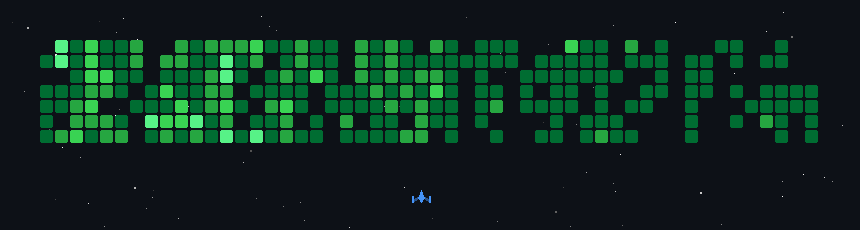

#### About me

I know Python and Java and I'm learning C++, TypeScript, and React.

I completed a 35 hour python course by Teclado last year and have been writing python programs for almost a year.

I enjoy homelabbing and coding.

Go check out [my website](https://codingcorner.dev)!

###

  
  
  
  
  
  
  
  
  
  
  
  
  
  
  
  
  
  

###

 

###
